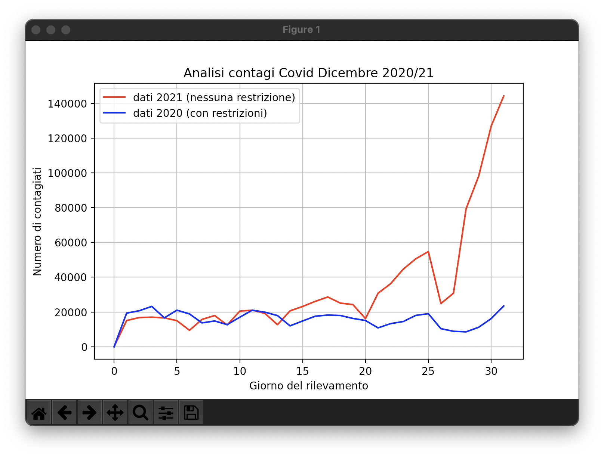

# Python analysis
## Warning!
⚠️The data entered in the CSVs are all data collected from various sources (mostly Italian news) and sometimes (rarely) I wrote the same data twice in a row as the data of that day were untraceable. Obviously this analysis cannot be compared to those of experts in the field.⚠️

In this repository you can find a first test of data analysis using python. the concept is very simple, I compare the data of the COVID-19 infections after two years. All this is analyzed through a Cartesian graph where on the abscissas we have the days of the survey (1 to 31 December) and on the ordinates the number of infections.

To run the code you need to install "pandas" and "matplotlib.pyplot" via pip.
```bash
pip install pandas
```

```bash
pip install matplotlib.pyplot
```

After that you can start running my code after downloading it.

Here is a preview of the output:



Have fun!
